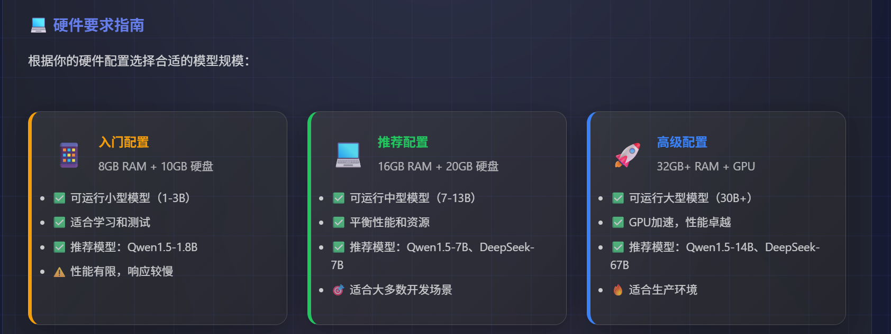

### 本地部署大模型（ollama）

除了调用云端API，你还可以在自己的电脑上部署开源大模型。这样可以完全离线使用，数据更安全，但需要一定的硬件配置。



常用的部署工具（ollama）：

```
Ollama 是目前最流行、最简单的本地大模型部署工具，一键安装，命令行操作，非常适合开发者。

核心优势：
一键安装：无需配置复杂环境
命令行操作：类似Docker，简单直观
自动下载：自动管理模型文件
API支持：提供REST API，方便集成
多平台：支持Windows、macOS、Linux


```

#### ollama安装

**1：下载ollama**
访问官网下载：[https://ollama.ai](https://ollama.ai/)

**2：安装ollama**
双击安装包，按提示完成安装。安装后会自动启动Ollama服务。macOS用户可以通过Homebrew安装：`brew install ollama`

**3： 下载模型**

打开终端，运行以下命令下载模型：

```
# 下载通义千问1.8B模型（推荐新手）
ollama pull qwen:1.8b

# 下载通义千问7B模型（推荐日常使用）
ollama pull qwen:7b

# 下载DeepSeek 7B模型（编程能力强）
ollama pull deepseek-coder:6.7b
```

**4：开始对话**

在终端中直接运行：

```
# 启动通义千问对话
ollama run qwen:1.8b

# 启动DeepSeek编程助手
ollama run deepseek-coder:6.7b
```

### ollama常用命令

下面是本地部署最常用的一组命令：模型管理（下载/查看/删除）、运行管理（查看/停止）、以及 API 调试与自定义模型。

```
# 1) 查看本地已有模型
ollama list

# 2) 拉取（下载）模型
ollama pull qwen:7b

# 3) 运行模型（进入交互式对话）
ollama run qwen:7b

# 4) 直接把一句话喂给模型（适合脚本）
ollama run qwen:7b "用一句话解释RAG"

# 5) 查看当前正在运行的模型（类似 docker ps）
ollama ps

# 6) 停止某个正在运行的模型
ollama stop qwen:7b

# 7) 查看模型详细信息（参数/模板等）
ollama show qwen:7b

# 8) 删除模型（释放磁盘空间）
ollama rm qwen:7b

# 9) 复制一个模型并重命名（用于做自己的变体）
ollama cp qwen:7b my-qwen:7b

# 10) （进阶）从 Modelfile 创建自定义模型（常用来改 system prompt/模板）
# 新建 Modelfile：
#   FROM qwen:7b
#   SYSTEM "你是一个严谨的Java后端+AI应用工程师，回答要给代码与边界条件"
#   PARAMETER temperature 0.2
ollama create my-qwen:7b -f Modelfile
```

💡 **运行与资源提示：** `ollama ps` 可以快速确认是否在后台占用内存；不使用就 `ollama stop` 释放资源。

**API调试：**

```
# Ollama 默认服务端口：11434
# /api/generate：最常用的生成接口
curl http://localhost:11434/api/generate \
  -H "Content-Type: application/json" \
  -d '{
    "model": "qwen:7b",
    "prompt": "写一个Java的Hello World",
    "stream": false
  }'

# 流式输出（stream=true），可用于“打字机效果”
curl http://localhost:11434/api/generate \
  -H "Content-Type: application/json" \
  -d '{
    "model": "qwen:7b",
    "prompt": "用三点总结Transformer",
    "stream": true
  }'
```

💡 **多设备/局域网访问：**如果你想让同网段设备访问 Ollama API，需要将服务监听到 `0.0.0.0` （不同系统配置方式不同，以 Ollama 文档为准）。本机开发默认 `localhost:11434` 即可。

#### **2️⃣ Python调用本地模型**

Ollama提供了REST API，可以用任何编程语言调用。这里以Python为例：

#### 🌐 如果不是 localhost 的 Ollama，要改什么？

- **服务端（跑 Ollama 的那台机器）**：需要让 Ollama 监听对外地址（否则只能本机访问）。常见做法是设置环境变量 `OLLAMA_HOST`，例如：`0.0.0.0:11434`（具体以 Ollama 文档为准）。
- **网络/防火墙**：确保远端机器的 `11434` 端口允许访问（同网段/公网/安全组）。
- **安全建议**：不要直接暴露到公网。推荐只在内网用，或在前面加反向代理/鉴权（例如 Nginx + Basic Auth / IP 白名单）。
- **客户端代码**：把 `base_url` 从 `http://localhost:11434` 改成 `http://{远端IP或域名}:11434`。

```
# 例：调用远端 Ollama（内网机器）
# 假设 Ollama 部署在 192.168.1.50
client = OllamaClient(base_url="http://192.168.1.50:11434")
resp = client.chat("qwen:7b", "解释一下 top_p")
print(resp)

# 如果你用的是域名/反向代理（带鉴权），base_url 改成对应地址即可
# 例如：https://ollama.yourdomain.com
```

```
api调用示例：

import requests
import json


class OllamaClient:
    def __init__(self, base_url="http://localhost:11434"):
        self.base_url = base_url

    def chat(self, model, message, stream=False):
        """调用本地模型进行对话

        重要：如果一个函数体里出现了 yield，那么这个函数会变成“生成器函数”。
        为了保证：
        - stream=False 时返回字符串（模型完整结果）
        - stream=True 时返回迭代器（逐段产出）
        我们把 yield 放到内部生成器函数里。
        """
        url = f"{self.base_url}/api/generate"

        payload = {
            "model": model,
            "prompt": message,
            "stream": stream
        }

        # 1) 流式：返回一个“内部生成器”，外部 for chunk in client.chat(..., stream=True)
        if stream:
            def _gen():
                try:
                    # 注意：requests 需要 stream=True 才能边下边读
                    response = requests.post(url, json=payload, stream=True)
                    response.raise_for_status()

                    for line in response.iter_lines():
                        if not line:
                            continue
                        data = json.loads(line)
                        chunk = data.get("response", "")
                        if chunk:
                            yield chunk

                        # Ollama 会在最后一条返回 done=true
                        if data.get("done") is True:
                            break
                except Exception as e:
                    yield f"调用失败：{str(e)}"

            return _gen()

        # 2) 非流式：直接返回字符串
        try:
            response = requests.post(url, json=payload, stream=False)
            response.raise_for_status()
            result = response.json()
            return result.get("response", "")
        except Exception as e:
            return f"调用失败：{str(e)}"


# 使用示例
if __name__ == "__main__":
    client = OllamaClient()

    # 非流式（返回字符串）
    response = client.chat("qwen:1.8b", "什么是Python？", stream=False)
    print("通义千问回答：", response)

    # 流式（返回迭代器）
    for chunk in client.chat("deepseek-coder:6.7b", "写一个Python Hello World", stream=True):
        print(chunk, end="", flush=True)
```

#### 💡 实用技巧

- **模型选择**：根据任务复杂度选择合适大小的模型
- **内存管理**：大模型会占用大量内存，不使用时可以停止服务
- **批量处理**：对于大量文本，可以分批处理避免内存溢出
- **错误处理**：网络连接可能失败，建议添加重试机制

💡 **远程调用常见错误排查：** 1）`Connection refused`：端口没开/服务没监听对外； 2）`Timeout`：网络不可达/防火墙拦截； 3）模型不存在：先在远端执行 `ollama list` 确认模型标签。


#### 🔗 用 LangChain 访问 Ollama（更贴近真实项目）

如果你后续要做 RAG / Agent，推荐直接用 LangChain 对接 Ollama，把模型调用变成可组合的组件。

```none
# 安装 LangChain（Ollama 集成一般在 community 包里）
pip install -U langchain langchain-community
```

```
from langchain_community.llms import Ollama

# 1) 本地 Ollama
llm = Ollama(model="qwen:7b", base_url="http://localhost:11434")

# 2) 如果是远程 Ollama，把 base_url 改成远端地址即可
# llm = Ollama(model="qwen:7b", base_url="http://192.168.1.50:11434")

result = llm.invoke("用三点解释 top_p 和 temperature 的区别")
print(result)
```

💡 你在项目里通常会把 `base_url` 配到环境变量（例如 `OLLAMA_BASE_URL`）， 这样本地/远程切换不需要改代码。


#### 🎉 本地部署优势总结

- **数据安全**：所有数据都在本地处理，不会上传到云端
- **离线可用**：无需网络连接，随时可以使用
- **成本控制**：一次部署，无限使用，无API调用费用
- **定制化**：可以微调模型，适应特定业务需求
- **响应速度**：本地调用速度快，无网络延迟


### Python调用本地大模型

Ollama提供了REST API，可以用任何编程语言调用。这里以Python为例：

#### 如果不是localhost的Ollama，要改什么？

1：服务端（跑Ollama的那台机器）：需要让Ollama监听对外地址（否则只能本机访问）。常见做法是设置环境变量OLLAMA_HOST，例如：0.0.0.0:11434（具体以Ollama文档为准）。

2：网络/防火墙：确保远端机器的11434端口允许访问（同网段/公网/安全组）。

3：安全建议：不要直接暴露在公网。推荐只在内网用，或在前面加反向代理/鉴权（例如Nginx+Basic Auth/IP白名单）。

4：客户端代码：把base_url从http://localhost:11434改成http://远程IP/域名:11434.

```
# 例：调用远端 Ollama（内网机器）
# 假设 Ollama 部署在 192.168.1.50
client = OllamaClient(base_url="http://192.168.1.50:11434")
resp = client.chat("qwen:7b", "解释一下 top_p")
print(resp)

# 如果你用的是域名/反向代理（带鉴权），base_url 改成对应地址即可
# 例如：https://ollama.yourdomain.com
```


当我自己的电脑上面启动了allama的大模型，如果我想要外部的电脑也可以访问我本机的这个allama上的大模型，应该怎么设置防火墙的白名单，让其他电脑也可以访问我这个本机的allama大模型

详细解释：

想让局域网里的其他电脑访问你电脑上的 Ollama 大模型，只需要完成两步：一是让服务监听所有网络请求，二是在防火墙中放行相应的端口。

针对 Windows 的详细操作指南：

1：配置 Ollama 监听地址。Ollama 安装后默认只允许本机访问 (`127.0.0.1`)。要让其他设备能访问，需要设置一个环境变量 `OLLAMA_HOST`，让它监听你电脑的局域网 IP。

**操作步骤如下：**

1. **退出 Ollama**：先**完全退出**Ollama应用程序。右键点击系统托盘中的Ollama图标，选择 "Quit" 或 "Exit"。
2. **打开系统环境变量**：在Windows搜索框输入"编辑系统环境变量"，打开"系统属性"窗口，点击下方的"**环境变量**"。
3. **新建系统变量**：在"系统变量"区域点击"**新建**"，创建如下变量：
   - **变量名**：`OLLAMA_HOST`
   - **变量值**：`0.0.0.0:11434` (表示监听所有网络接口)
4. **保存并重启**：一路点击"确定"保存设置，然后**重新启动** Ollama 应用程序。


2：配置 Windows 防火墙。设置了监听地址后，还需要在 Windows 防火墙中创建一个"白名单"规则，允许外部设备访问 Ollama 的端口（通常是 `11434`）。

**操作步骤如下：**

1. 打开"控制面板" > "系统和安全" > "Windows Defender 防火墙"，点击左侧的"**高级设置**"。
2. 在左侧菜单选中"**入站规则**"，然后在右侧点击"**新建规则...**"。
3. **规则类型**：选中"**端口**"，点击"下一步"。
4. **协议和端口**：选择"**TCP**"，并在"特定本地端口"一栏输入 `11434`，然后点击"下一步"。
5. **操作**：选择"**允许连接**"，点击"下一步"。
6. **配置文件**：保持全选（域、专用、公用）即可，点击"下一步"。
7. **名称**：为这个规则起一个名字，比如"`Ollama Allow Port 11434`"，点击"完成"。


3：验证与连接。

​	1：获取你电脑的局域网IP：

- 按win+R，输入cmd回车

- 在命令行输入ipconfig并回车

- 找到你的网络连接（通常是“以太网适配器”或“无线局域网适配器”），在下方找到“IPv4地址”，类似192.168.x.x或10.x.x.x。记住这个地址

  2：在其他电脑上测试连接：

- 在同一局域网的其他电脑上，打开浏览器，访问：http://[你的电脑IP]:11434
- 如果能看到Ollama is running的提示，就说明配置成功了！

4：客户端如何调用。配置成功后，其他电脑就不需要再安装 Ollama 了，可以直接通过网络请求调用你的模型。

- **通过API调用**：将原本调用的 `http://localhost:11434` 替换为 `http://[你的电脑IP]:11434` 即可。
- **通过Open WebUI**：如果你在Docker中运行 Open WebUI，可以在启动时将 `OLLAMA_BASE_URL` 环境变量的值设为 `http://[你的电脑IP]:11434`。


### 注意事项：

Ollama 服务**默认没有任何身份验证和访问控制**。这意味着开放端口后，**任何能连接到你局域网的人都能使用你的大模型**。

除了设置防火墙白名单，还有几点安全建议：

1. **只给信得过的IP开白名单**：在上述"新建入站规则"的第二步（"协议和端口"之后），可以选择"作用域"页签，在"远程IP地址"中添加允许访问的特定IP地址，实现更严格的控制。
2. **避免暴露在公网**：如果你只是在公司或家里使用，完成上述局域网配置即可。**除非你非常清楚风险，否则不建议通过路由器端口转发等方式将服务暴露在公网上**。
3. **使用反向代理增加验证**：对于更高级的用法，可以用 Nginx 等工具设置反向代理，添加一层密码保护。